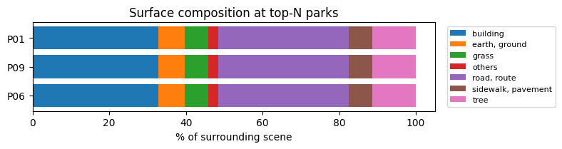

# Temperature API Quickstart

A Python + Jupyter sandbox for the [FortyGuard tOS Enterprise API](https://api.fortyguard.com). Drop in your API key and run a notebook — you'll get a heatmap, a heat-intelligence PDF, or an environmental-parameter time series in minutes.

> **Starting a hackathon project?** Click **Use this template → Create a new repository** (green button, top of this page) to spin up your own copy to work in, then follow [Getting started](#getting-started) below.

The `fortyguard/` package wraps every endpoint the API exposes and handles the submit-then-poll pattern for you. The `notebooks/` folder walks you through each endpoint with runnable examples, and `notebooks/use_cases/` shows full narrative workflows that combine your own data with FortyGuard layers to produce a defensible action list.


*Above: the bundled 24-hour heatmap rendered tile-by-tile — daily mean (left) and daily peak (right) across ~16,500 tiles. The southeast urban heat island is exactly the kind of pattern the use-case notebooks pick up when they join your point list against this layer.*


*And the one-line summary card every use-case notebook prints right after loading the heatmap — min / mean / max swatches, a colored histogram of every tile's peak, and a continuous colorbar.*

---

## What you can do here

### Endpoint walkthroughs

| # | Notebook | Endpoint | Plan |
|---|----------|----------|------|
| 00 | [Setup & authentication](notebooks/00_setup.ipynb) | `POST /v1/system/fetch-api-key-custom-usage` | Both |
| 01 | [Create heatmap](notebooks/01_create_heatmap.ipynb) | `POST /v1/heatmap` | Both |
| 02 | [Environmental parameters](notebooks/02_environmental_parameters.ipynb) | `POST /v1/env_params` | Both |
| 03 | [Satellite segmentation](notebooks/03_satellite_segmentation.ipynb) | `POST /v1/satellite` | Premium |
| 04 | [Street view segmentation](notebooks/04_street_view_segmentation.ipynb) | `POST /v1/streetview` | Premium |
| 05 | [Heat intelligence report](notebooks/05_heat_intelligence_report.ipynb) | `POST /v1/heat_intelligence` | Premium |

All analysis endpoints are asynchronous: you submit a request, get an `activity_id`, and poll `GET /v1/status/{activity_id}` until the task finishes. The client does the polling for you — you just call `client.create_heatmap(...)` and get the result back.

#### How a request actually flows

```
       you / notebook              FortyGuard API
            │                            │
            │  POST /v1/<endpoint>       │   (payload: AOI / point + date_time + ...)
            │ ─────────────────────────► │
            │                            │
            │  { activity_id: "..." }    │   202-style accept — task queued
            │ ◄───────────────────────── │
            │                            │
            │  GET /v1/status/{id}       │
            │ ─────────────────────────► │   ┐
            │  { status: "Processing" }  │   │  client polls every
            │ ◄───────────────────────── │   │  poll_interval seconds
            │  GET /v1/status/{id}       │   │  (default: 3s) until
            │ ─────────────────────────► │   │  status terminates
            │  { status: "Completed",    │   │
            │    result: {...} }         │   ┘
            │ ◄───────────────────────── │
```

*(Status strings are matched case-insensitively, so the client handles
`Completed`/`completed`/`succeeded` alike.)*

`client.<endpoint>(...)` does all of that in one call and returns `{"activity_id": ..., "result": ...}`. If you'd rather drive the polling yourself, pass `wait=False` to get the `activity_id` immediately, then call `client.get_status(activity_id)` or `client.wait_for(activity_id)` on your own schedule.

> **Why async?** Heatmaps, segmentation, and PDF reports take seconds-to-minutes — the API queues them so a slow result never blocks your HTTP connection. Failed tasks are free; credits are deducted only once a task reaches `Completed`.

### Use-case notebooks

Once you've completed `00_setup.ipynb`, jump into a narrative workflow that combines **your own data** with FortyGuard layers to produce a ranked, defensible action list. See [`notebooks/use_cases/`](notebooks/use_cases/README.md) for the full index. The five available today:

| Persona / industry | Your data | Output |
|-------------------|-----------|--------|
| [Real-estate portfolio heat risk](notebooks/use_cases/real_estate_portfolio_heat_risk.ipynb) | Property portfolio | Client-deck slide pack (M1/M2/M3 maps) + per-property action brief citing public programs (EPA, USDA, ASHRAE, OSHA) |
| [Urban planner — bus-stop cooling](notebooks/use_cases/urban_planner_bus_stop_prioritization.ipynb) | Bus-stop points | Ranked intervention list |
| [Public-parks heat-resilience audit](notebooks/use_cases/public_parks_heat_resilience_audit.ipynb) | Park points (id + type + acres + lat/lon) | Per-park audit with declarative, threshold-triggered recommendations citing federal programs |
| [Single-parcel heat due diligence](notebooks/use_cases/parcel_site_due_diligence.ipynb) | **One parcel boundary** (polygon GeoJSON) | `reportAll` bundle — branded PDF + evaluation CSV + findings CSV + maps, from **all five endpoints** on one site |
| [Multi-parcel heat screening](notebooks/use_cases/parcel_portfolio_heat_screening.ipynb) | **Several parcel boundaries** (multi-feature polygon GeoJSON) | Ranked shortlist — one 14 km² AOI across the whole portfolio, area-weighted per parcel, expensive endpoints spent only on the top few. **Temperatures in °F with °C in brackets** |

> **The two parcel notebooks are the ones to demo to a client on their own sites.** They take boundaries rather than point lists and run building-scale AOIs instead of citywide ones. Use the **single-parcel** one for "should I buy this site" and the **multi-parcel** one for "which of these sites should I pursue". See [Parcel scale vs. city scale](#parcel-scale-vs-city-scale) below for why both lead with exposure *duration* rather than peak temperature.

> **These two run with no API key.** Unlike the rest of the repo, the parcel notebooks ship both their input boundaries and their cached API responses. Clone, `pip install -r requirements.txt`, open either notebook, and Run All — you get the full report bundle offline, with zero credits spent. Everything else in `data/` is git-ignored; set `REFRESH = True` in a parcel notebook's Setup cell when you do want live calls.

Bring your own inputs: create a `data/` directory (it's git-ignored, not shipped) and drop in a CSV with the columns each notebook documents — everything downstream works. See each use-case notebook's intro for the expected schema.



*Example output from the public-parks audit: a satellite-segmentation stacked bar tells the parks director why each top park is hot — the building, road, and tree shares feed straight into threshold-triggered recommendations like "USDA Forest Service i-Tree planting plan" or "EPA Heat Island Reduction cool-pavement retrofit".*

---

## Prerequisites

- Python 3.10 or newer
- A FortyGuard API key (Basic or Premium tier)
- About 5 minutes

---

## Getting started

### 1. Clone and create a virtual environment

```bash
git clone <this-repo> temperature-api-quickstart
cd temperature-api-quickstart

python -m venv venv
# Windows
venv\Scripts\activate
# macOS / Linux
source venv/bin/activate
```

### 2. Install dependencies

```bash
pip install -r requirements.txt
```

### 3. Add your API key

```bash
cp .env.example .env
```

Open `.env` and paste your key:

```env
FORTYGUARD_API_KEY=fg_live_xxxxxxxxxxxxxxxx
FORTYGUARD_BASE_URL=https://api.fortyguard.com
```

> The `.env` file is git-ignored — your key will not be committed.

### 4. Launch Jupyter

```bash
jupyter lab
```

Open `notebooks/00_setup.ipynb` and run every cell top-to-bottom. If the last cell prints your plan and remaining credits, you're wired up. Continue through the remaining notebooks in order, then pick a use-case workflow.

---

## Using the Python client directly

Outside a notebook:

```python
from dotenv import load_dotenv; load_dotenv()
from fortyguard import FortyGuardClient

client = FortyGuardClient()  # picks up FORTYGUARD_API_KEY from .env

response = client.create_heatmap(
    polygon_aoi={
        "type": "FeatureCollection",
        "features": [{
            "type": "Feature", "properties": {},
            "geometry": {
                "type": "Polygon",
                "coordinates": [[
                    [-74.017, 40.705], [-74.003, 40.705],
                    [-74.003, 40.718], [-74.017, 40.718],
                    [-74.017, 40.705],
                ]],
            },
        }],
    },
    start_date="2024-07-15",
    start_time="14:00",
    filter_type=1,        # 1=single hour, 2=range of hours, 3=single day, 4=range of days
    granularity=100,      # meters: 60, 80, or 100
)

print(response["activity_id"])
print(response["result"]["stats_data"])
```

### Analysis heatmaps (`analytic_type`)

`create_heatmap` defaults to `analytic_type="tcm"` — the classic snapshot. Over a
multi-hour or multi-day window (`filter_type` 2 or 4) you can ask for three
analysis heatmaps instead, each derived from the same time series:

| `analytic_type` | What each cell shows | Units | Extra params |
|-----------------|----------------------|-------|--------------|
| `tcm` *(default)* | Snapshot temperature | °C | — |
| `time_of_measure` | **UTC hour-of-day** (0–23) of the cell's peak | hour | — |
| `exceedance` | **Count of hours** the cell spends past `threshold` | hour | `threshold` (°C), `direction` |
| `persistence` | **Longest continuous run** of such hours | hour | `threshold` (°C), `direction` |

```python
response = client.create_heatmap(
    polygon_aoi=aoi,
    start_date="2024-07-15",
    end_date="2024-07-21",
    filter_type=4,               # range of days
    analytic_type="exceedance",
    threshold=35.0,              # °C
    direction="above",           # count hours above 35 °C
)
```

`threshold` and `direction` (`"above"`/`"below"`) are required for `exceedance`
and `persistence`, and ignored for the other types.

> **`threshold` is °C** — the same unit as the `tcm` tile temperatures, which
> the Enterprise API also returns in **°C** (default threshold 30 °C).

> **`exceedance` is a count of hours, not degree-hours.** A value of `6.0` means
> the cell spent six hours past the threshold — it is not accumulated °C·h.

#### Response shape for analysis heatmaps

The three analysis types return a **different schema from `tcm`** — one `value`
per tile rather than temperature fields:

```jsonc
// analytic_type = time_of_measure | exceedance | persistence
{
  "map_data": {                         // GeoJSON FeatureCollection
    "features": [
      { "properties": { "tile_id": 0, "value": 6.03 }, "geometry": {...} }
    ]
  },
  "stats_data": {
    "activity_id": "...",
    "analytic_type": "exceedance",      // echoes the requested type
    "units": "hour",
    "n_cells": 150,
    "min": 0.98, "max": 6.03, "mean": 2.46
  }
}
```

By contrast `tcm` returns `properties.average_temperature` / `min_temperature` /
`max_temperature` (°C) and a `stats_data` carrying `temperature_stats` plus the
distribution fields. So code that reads `properties.temperature` will find
nothing on an analysis heatmap — read `properties.value` and interpret it with
`stats_data.units`.

Every endpoint has its own method:

| Method | What it does |
|--------|--------------|
| `client.create_heatmap(...)` | Thermal map over a polygon AOI |
| `client.environmental_parameters(...)` | Heat index, AQI, solar irradiance at a point |
| `client.satellite_segmentation(...)` | Land-cover classes from a satellite tile *(Premium)* |
| `client.street_view_segmentation(...)` | Segmentation of a ground-level view *(Premium)* |
| `client.heat_intelligence(...)` | Multi-dimensional PDF report *(Premium)* |
| `client.fetch_api_key_usage()` | Current billing cycle summary |
| `client.fetch_api_key_custom_usage(start_date, end_date)` | Usage over a custom window |
| `client.get_status(activity_id)` | Raw status of a submitted task |
| `client.wait_for(activity_id)` | Block until a task terminates |

Pass `wait=False` to any analysis method to get the `activity_id` immediately and poll it yourself.

---

## Project layout

```
temperature-api-quickstart/
├── README.md                 # this file
├── requirements.txt          # pinned dependencies
├── .env.example              # template — copy to .env
├── docs/
│   └── images/               # README screenshots
├── fortyguard/               # Python client
│   ├── client.py             # FortyGuardClient — one method per endpoint
│   ├── exceptions.py         # FortyGuardError, TaskFailedError, TaskTimeoutError
│   └── samples.py            # sample polygons and points for demos
├── data/                     # YOU create this — git-ignored, not shipped with the repo
│   ├── sample_bus_stops.csv                     # bus-stops use-case input (bring your own)
│   ├── sample_public_parks.csv                  # parks use-case input (bring your own)
│   ├── real_estate_san_jose_portfolio_sample.csv  # real-estate use-case input (bring your own)
│   ├── parcel_diridon_san_jose_sample.geojson   # parcel use-case input — one polygon boundary
│   ├── parcel_portfolio_san_jose_sample.geojson # multi-parcel screening input — 6 boundaries
│   └── <subdirs>/            # optional: cached API responses you save to replay with CACHED=True
│                             #   (heatmaps/, satellite/, street_view/, env_params/)
├── outputs/                  # generated hand-off bundles — gitignored
│   └── <usecase>_<STUDY_DATE>/  # one folder per run: CSV + PDF + maps/*.html
└── notebooks/
    ├── 00_setup.ipynb                     # auth + credit check — run first
    ├── 01_create_heatmap.ipynb ... 05_heat_intelligence_report.ipynb
    └── use_cases/                         # narrative workflows (your data × FortyGuard layers)
        ├── README.md
        ├── real_estate_portfolio_heat_risk.ipynb
        ├── urban_planner_bus_stop_prioritization.ipynb
        ├── public_parks_heat_resilience_audit.ipynb
        ├── parcel_site_due_diligence.ipynb    # one parcel boundary, all five endpoints
        └── parcel_portfolio_heat_screening.ipynb  # many boundaries, ranked shortlist, °F
```

---

## Parcel scale vs. city scale

The three point-based use cases run over a citywide AOI (~104 km²) and rank points against each other. The two parcel notebooks work at building scale, where two things change and the workflow has to change with them.

**A parcel is smaller than a tile.** The finest granularity the heatmap offers is 60 m. A 3.3-acre parcel (140 × 100 m) spans under four tiles, so there is no "hot spot within the parcel" to find, and a nearest-tile lookup would silently discard most of the site. Both parcel notebooks compute an **area-weighted mean** over every tile the boundary overlaps, weighted by overlap area.

**At parcel scale the temperature snapshot is nearly flat — duration is not.** Measured across three AOI sizes:

| AOI | Area | Daily-peak spread | Exceedance spread |
|---|---|---|---|
| Citywide (2024-07-15) | 104 km² | 5.85 °C / 10.5 °F | — |
| Portfolio hull + 400 m (2026-08-03) | 14 km² | **0.94 °C / 1.70 °F** | **6.5 h** |
| Single parcel + 500 m (2024-07-15) | 1.2 km² | **0.90 °C / 1.62 °F** | **15.2 h** |

Peak temperature barely separates sites below city scale; hours-above-threshold does. So both parcel notebooks lead with `exceedance` and `persistence`. The single-parcel notebook uses a **citywide** percentile as its comparison; the multi-parcel one compares parcels against each other, which is what the larger AOI buys you.

### Reading `heat_index_celsius` correctly

The `env_params` endpoint applies your single `temperature` anchor across **all 24 hours** and varies only humidity. Heat index is a function of both, so the returned series tracks relative humidity — and because humidity peaks overnight, **the heat-index curve peaks around 2 a.m. and bottoms out mid-afternoon**. In the bundled San Jose parcel run it reads 32.5 °C at 02:00 and 27.3 °C at 14:00, while the real air temperature at 02:00 is about 16 °C.

It is a humidity-sensitivity curve at a fixed temperature, not a diurnal forecast. It is only physically meaningful at the hours when actual temperature is near the anchor — the afternoon peak. Compare against a published threshold **at the hot hour** (both parcel notebooks use the hour when `apparent_temperature_celsius`, which does follow the real diurnal cycle, is highest), and take duration from the heatmap `exceedance` layer instead of counting hours in this series.

On a hot day the artifact gets extreme: for 2026-08-03, a 37.2 °C anchor paired with 84% small-hours humidity produces a heat index of **159 °F (70 °C) at 05:00** — well past the end of the NWS table. The multi-parcel notebook scales its chart axis to the physically meaningful series and lets that curve clip off-scale with a note, rather than letting one artifact compress every real curve into the bottom of the panel.

**`env_params` is also coarser than a parcel.** It resolves on a weather grid coarser than parcels within one district are apart — in the bundled screening run, two parcels **1.36 km apart return byte-identical arrays** (same apparent temperature, wet-bulb, humidity, air quality). Only heat index differs between them, and only because each parcel is sent its own `temperature` anchor from the heat layer. Use these curves to characterise the district; use the heatmap layers, which resolve at `GRANULARITY_M`, to discriminate between sites. The multi-parcel notebook detects identical responses and warns explicitly.

### Units

The API returns Celsius throughout. [`parcel_portfolio_heat_screening.ipynb`](notebooks/use_cases/parcel_portfolio_heat_screening.ipynb) displays **Fahrenheit with Celsius in brackets** — `97.4 °F (36.3 °C)` — via three helpers set once in its Setup cell (`tf()` to format, `c2f()` to convert for plotting, `add_celsius_axis()` to mirror a chart axis). Conversion happens only at display time, so stored values, CSV columns, and threshold comparisons all stay in the API's native Celsius and cannot drift from what is shown.

---

## Useful things to know

- **Coverage is U.S. only.** All endpoints operate over locations inside the United States. Polygons / points outside the U.S. will return errors or empty results — don't waste credits on AOIs in other countries.
- **Date range.** The temperature catalog covers **2021 to today**. Pick a `start_date` on or after `2021-01-01` — earlier dates have no coverage and the request will fail with a "no data available for this area and date" error. Future dates are also unsupported (a `start_date` later than today fails).
- **Coordinates are `[longitude, latitude]`** in GeoJSON — not the other way around.
- **Filter types** for endpoints that take `date_time`: `1` = single hour (needs `start_time`), `2` = range of hours (same day; `start_time`+`end_time`), `3` = single day (full 24 h; needs only `start_date` — `start_time` is ignored), `4` = range of days (pass `end_date`; window capped at ~31 days).
- **Analysis heatmaps.** `create_heatmap` accepts `analytic_type` (`tcm` / `time_of_measure` / `exceedance` / `persistence`) to derive time-of-peak, exceedance-count, or persistence maps from a multi-hour/multi-day window. `exceedance` and `persistence` also need `threshold` (**°C**, same unit as the tile readings) and `direction`. The three analysis types return `properties.value` (units in `stats_data.units`, currently `hour`) instead of the `tcm` temperature fields — see [Analysis heatmaps](#analysis-heatmaps-analytic_type).
- **Failed tasks are free.** Credits are only deducted once a task reaches `Completed`.
- **Heat intelligence returns a PDF**, not JSON. The client streams it to `outputs/` and returns the file path.
- **Cached mode for use-case notebooks.** Each use-case notebook has a `CACHED` flag (default `False` — runs **live**, so you need an API key). The `data/` directory is **not** shipped with the repo (`.gitignore` excludes it); bring your own inputs. If you save a run's responses under `data/` you can flip `CACHED=True` to replay them offline, but a fresh clone starts live-only.
- **Base URL override.** Point `FORTYGUARD_BASE_URL` at the dev environment (`https://tos-enterprise-api.dev.app.fortyguard.com`) for testing.

---

## Troubleshooting

| Symptom | Likely cause | Fix |
|---------|--------------|-----|
| `FortyGuardError: No API key provided` | `.env` missing or not loaded | Confirm `.env` sits at the repo root and contains `FORTYGUARD_API_KEY=...` |
| `401` on any call | Wrong key or wrong tier | Check the key in the FortyGuard console; some endpoints are Premium-only |
| `TaskTimeoutError` | Long-running task | Pass a larger `timeout=` when calling the method (e.g. `timeout=1800`) |
| `TaskFailedError` | Invalid payload (bad polygon, bad date, area too large) | Read the error message; Basic is capped at 10 mi² heatmaps |
| Notebook can't import `fortyguard` | Jupyter was launched from inside `notebooks/` | Launch `jupyter lab` from the repo root |

---

## Extending

Adding a new endpoint? Drop a new method onto `FortyGuardClient` that calls `self._submit_and_wait("/v1/your-path", payload, ...)` — the submit/poll plumbing is shared. Then add a notebook under `notebooks/` numbered after the existing ones.
